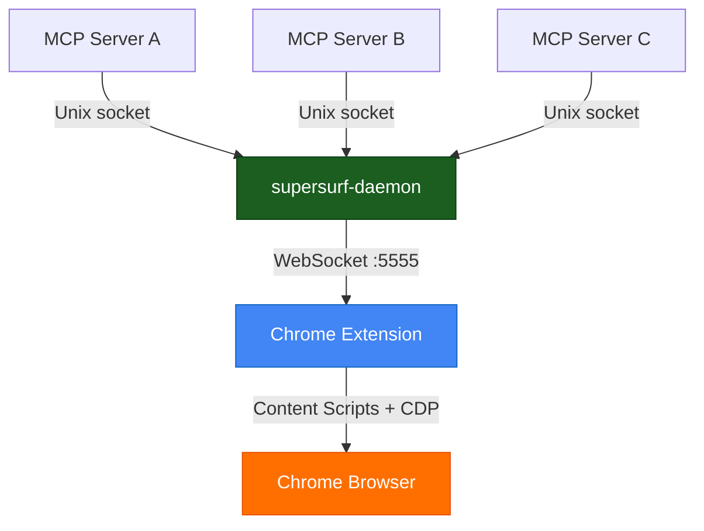

# supersurf-daemon

Multiplexer for SuperSurf — coordinates multiple MCP sessions sharing one Chrome extension connection.

**You don't install or configure this.** The MCP server ([`supersurf-mcp`](https://www.npmjs.com/package/supersurf-mcp)) automatically spawns the daemon when an agent calls `connect`. If a daemon is already running, it connects to the existing instance instead — no duplicate processes, no wasted memory.

## Architecture

The daemon owns WebSocket connections to Chrome extensions. MCP servers connect to it over a Unix domain socket (`~/.supersurf/daemon.sock`). Tool calls are scheduled round-robin across sessions, with tab ownership enforcement — sessions can't touch each other's tabs.

The daemon also manages a **connection pool** — multiple Chromium instances each with their own extension, matched to agent sessions by profile name via the `Matchmaker`.

## Lifecycle

- **Auto-spawned** by the MCP server on `connect` from the bundled daemon entry resolved inside the installed `supersurf-mcp` package (never fetched from the network)
- **Single instance** — detects an existing daemon via PID file and skips spawning
- **Stays alive** when sessions disconnect, keeping the extension connection warm
- **Idle timeout** — exits after 10 minutes with no connected sessions

## Profiles

The daemon manages isolated Chromium profiles (default-on since v2.1.0 — no experiment flag required):

- **Profile Registry** — CRUD for isolated Chromium profiles under `~/.supersurf/profiles/`
- **Chromium Spawning** — auto-launches Chromium with `--user-data-dir` and `--load-extension` per profile
- **Matchmaker** — connection pool routing agent sessions to the correct Chromium instance
- **Crash Recovery** — PID log replay on startup to kill orphan Chromium processes

Agents use `profiles.create`, `profiles.list`, `profiles.delete`, and `profiles.connect` via IPC.

## Protocol

1. MCP server connects to `~/.supersurf/daemon.sock`
2. Sends `{ type: "session_register", sessionId: "..." }\n`
3. Daemon responds `{ type: "session_ack", browser: "Chrome", buildTimestamp: "..." }\n`
4. Post-handshake: NDJSON (newline-delimited JSON-RPC 2.0) for tool calls

## License

Apache-2.0 with Commons Clause.
